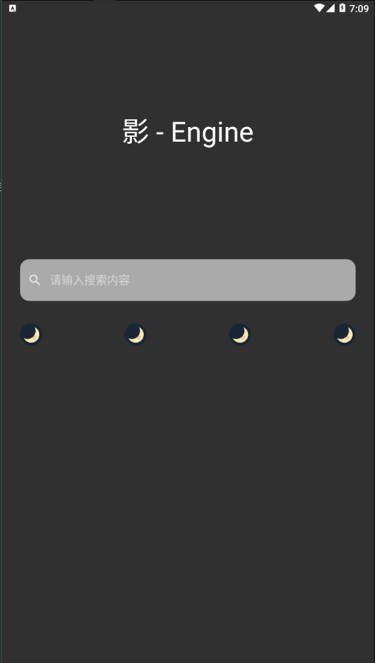

# speed_movie

极速影视 1.0

## 项目说明

一个flutter学习项目，一个简单的影视系统客户端  
项目资源全部来源于网络，本地不存储任何资源

- [Go语言编写的Server端](https://github.com/t924417424/speed_movie_Server)  
- Api接口修改请查看[lib/plugin/HttpUtil.dart](./lib/plugin/HttpUtil.dart)

项目截图：

| 启动页 | 搜索页 |
| :----: | :----: |
|  |  |

| 启动页_黑暗魔模式 | 结果页 |
| :----: | :----: |
|  |  |

| 播放页 |
| :----: |
|  |

项目仅用于学习和交流，严禁用于任何商业用途

水平有限，如果有什么问题可以留言

如果觉得对你有帮助，欢迎点赞和star    

免责声明  
本软件按“原样”提供，不提供任何形式的明示或暗示担保，包括但不限于对适销性，特定目的的适用性和非侵权性的担保。无论是由于软件，使用或其他方式产生的，与之有关或与之有关的合同，侵权或其他形式的任何索赔，损害或其他责任，作者或版权所有者概不负责。
